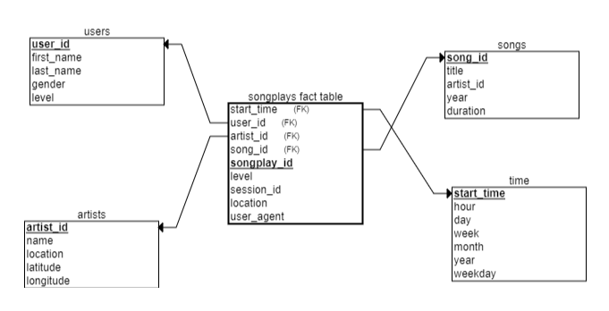

Project: Data Warehouse
-------------------------------------
Summary:
	Sparkify (music streaming startup) wants to move their processes and data onto the cloud.
	Relevant streaming data resides in S3, in a directory of JSON logs on user activity on the app, as well as a directory with JSON metadata on the songs in their app.
	The main of the project are as follows:
	1) Build an ETL (Extraction, Transformation and Load) pipeline that extracts from S3
	2) Stages the data in Redshift and transforms data into a set of dimensional tables
	3) Test the database and ETL pipeline by running queries

Dataset Location:
	Song data: s3://udacity-dend/song_data
	Log data: s3://udacity-dend/log_data
	Log data json path: s3://udacity-dend/log_json_path.json

Database Schema Design
------------------------
Fact Table: 
    songplays - records in event data associated with song plays i.e. records with page NextSong
	(Schema: songplay_id, start_time, user_id, level, song_id, artist_id, session_id, location, user_agent)

Dimension Tables:
    1) users - users in the app
       (Schema: user_id, first_name, last_name, gender, level)
    2) songs - songs in music database
       (Schema: song_id, title, artist_id, year, duration)
    3) artists - artists in music database
       (Schema: artist_id, name, location, latitude, longitude)
    4) time - timestamps of records in songplays broken down into specific units
       (Schema: start_time, hour, day, week, month, year, weekday)

Justification: The database was designed using Star schema because Star schema simplifies queries and can be used to perform fast aggregations/analytics

Explanations of Files and ETL Pipeline
----------------------------------------
	1) sql_queries.py: Contains all sql queries --> including queries to create and drop tables, queries to insert records in the tables
	2) create_tables.py: Connect to AWS Redshift, create DB, Drop existing tables and create new tables. Close DB connection.
	3) etl.py: Connect to database and run load_staging_tables to load data from JSON files into staging tables and run insert_tables to insert data in star schema tables
 
Note:  	dwh_aws.cfg --> Config file used to setup AWS Redshift cluster
		dwh.cfg --> Config file to connect to AWS Redshift cluster
		Project3_AWS_setup.ipynb --> Python notebook to setup AWS Redshift Cluster and to run test queries

Example queries (Result from Analysis)
---------------------------------------
Example 1: Get count of rows in users table
    QUERY: SELECT COUNT(1) FROM users; 

Example 2: Get info songs with duration greater than 200s limit to 10 records
    QUERY: 	SELECT DISTINCT songs.title, 
							songs.year, 
							songs.duration 
			FROM songplays 
			JOIN songs ON (songs.song_id=songplays.song_id) 
			WHERE songs.duration>200
			LIMIT 10;

How to Run Python Scripts
--------------------------
1) Setup AWS Redshift using Project3_AWS_setup.ipynb
2) Run create_tables.py --> python create_tables.py
3) Run etl.py --> python etl.py
4) Run sample queries in Project3_AWS_setup.ipynb
5) Delete Redshift cluster
